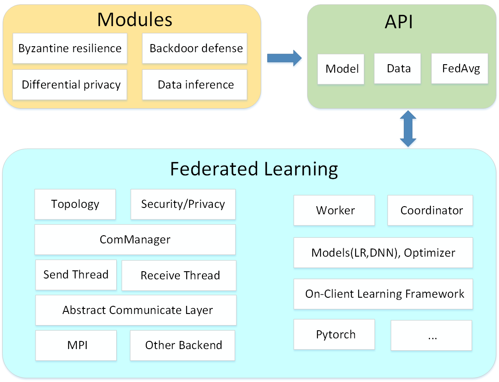

# Secure and Privacy Preserving Federated Learning System

As the development of artificial intelligence, centralized learning systems have found difficulties hard to overcome, such as privacy leakage and isolated data islands. Under such a circumstance, federated learning which allows participants to keep their own data while sharing the learning result is getting more and more attention. However, federated learning systems are still risky to security and privacy attacks, therefore it is crucial to develop a system to protect the security and privacy of federated learning.

We developed a secure and privacy preserving federated learning system based on Python. This system is capable to handle multiple popular attacks, ensuring the privacy of data and the robustness of model. We modularized our defense methods, so that the system itself can be used as a toolkit of secure and privacy preserving applicable to other federated learning systems, and that users can select or add other modules based on their demands.

The default system consists of four modules:

- Byzantine Resilience Module: Defend byzantine attacks by comparing the uploaded gradients.
- Backdoor Defense Module: Defend backdoor attacks by scaling the uploaded model and adding noise to it.
- Data Inference Defense Module: Defend data inference attacks by applying various transforming techniques to training images.
- Differential Privacy Module: Protect data privacy by adding noise to the gradients while traning.

## Installation Requirements

- torch (1.8.0)
- torchvision (0.9.0)
- numpy (1.19+)
- mpi4py (3.0.3+)
- argparse (1.4.0+)
- scipy (1.6.3+)
- logging (0.4.9.6+)

## Installation Guide

```bash
git clone git@github.com:csl-cqu/Federated-Learning-System.git
pip install -r requirements.txt
```

## Architecture



Detailed functionalities of each package:

- **assets**: Images used.
- **data**: Acquiring dataset CIFAR10, CIFAR100 and MNIST.
- **modules**: Implementation of four default modules.
- **core**: Implementation of distributed calculation.
- **api**: Implementation of federated learning based on core package.
- **experiment**: Configurations of GPU mapping.
- **sh**: Test scripts of different modules.

## Usage

Apply logistic regression to MNIST dataset:

1. Download dataset

   ```bash
   bash data/mnist/download_and_unzip.sh
   ```

2. Select or add GPU mapping, see [spfl_experiments/distributed/fedavg/GPU_MAPPING.md](spfl_experiments/distributed/fedavg/GPU_MAPPING.md)  

3. Run test script

   ```bash
   bash test/baseline_mnist_lr.sh
   ```

### Arguments

- **data_dir**: Location of the dataset.
- **partition_method**: Splittings of the dataset.
- **client_num_in_total**: Total number of clients.
- **client_num_per_round**: Number of clients selected per round.
- **client_optimizer**: Client optimizer.
- **backend:** Backend protocol of distributed learning.
- **wandb-off:** Whether to disable wandb.

The `test` Directory contains other scripts for other modules on other datasets. Please refer to the documentation of the corresponding module if you want to customize your run:

| Arguements                   | Module                    | README                                                       |
| ---------------------------- | ------------------------- | ------------------------------------------------------------ |
| `--byzantine_aggregate`      | Byzantine Fault Tolerance | [modules/byzantine_resilience/README.md](modules/byzantine_resilience/README.md) |
| `--backdoor-defense`         | Backdoor Defense          | [modules/backdoor_defense/README.md](modules/backdoor_defense/README.md) |
| `--data_recovery_protection` | Data Recovery Defense     | [modules/data_inference_defense/README.md](modules/data_inference_defense/README.md) |
| `--differential_privacy`     | Differential Privacy      | [modules/differential_privacy/README.md](modules/differential_privacy/README.md) |

## Acknowledgments

### Contributors

<a href="https://github.com/barryZZJ"></a> <a href="https://github.com/endereye"></a> <a href="https://github.com/Du11JK"></a> <a href="https://github.com/LuckMonkeys"></a>

### References

> FedML: 
> https://github.com/FedML-AI/FedML
>
> NDSS21-Model-Poisoning
> https://github.com/vrt1shjwlkr/NDSS21-Model-Poisoning

For more information, please run
```bash
python spfl_experiments/distributed/fedavg/main_fedavg.py -h
```
